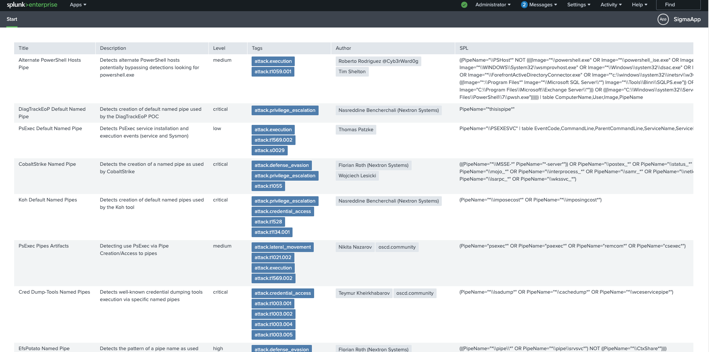

# Custom REST Endpoints

## How to use Splunk UI Toolkit for developing frontend?

In this section, I talked about developing frontend using SUIT.

Read for details [Play with Splunk | Sigma Rule Project - Splunk UI Toolkit (SUIT)](https://krdmnbrk.medium.com/play-with-splunk-sigma-rule-project-custom-rest-endpoint-32a04edd02f0)

There is a .spl file you can easily install the app following the below steps.

1. Log in to Splunk Web and navigate to Apps > Manage Apps.
2. Click install app from file.
3. Upload an file, click under file and go search the app that you want install
4. Click on upload after your restart Splunk web

The output is like the below image.

