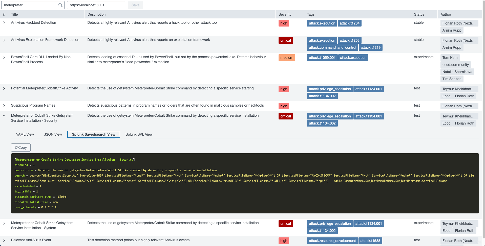

# Sigma Tool

## Sample Full Stack App without Splunk

In this section, I shared a full stack ([FReMP Stack](https://fremp.github.io/)) app that contains three main services.

1. Backend (Python/Flask)
2. Frontend (React)
3. Database (Mongo)

The app converts Sigma rules to Splunk SPL queries and provides a GUI that helps users search for them.

Each sigma rule has four tab:
1. YAML View
2. JSON View
3. Splunk Savedsearch View
4. Splunk SPL View

> SOC enthusiasts already know Sigma but I would like to share the repo link for first-time hearers.
> https://github.com/SigmaHQ/sigma

## Usage
```sh
git clone https://github.com/krdmnbrk/play-with-splunk
cd play-with-splunk/sigma_tool
docker compose up --build
```
Open your browser and navigate to localhost:8080
> You should have already installed docker and git on your system.
> https://www.docker.com/
> https://git-scm.com/downloads

## Sample images

Savedsearch View


SPL View


In next section, I will try to explain how to create custom REST endpoint on Splunk.